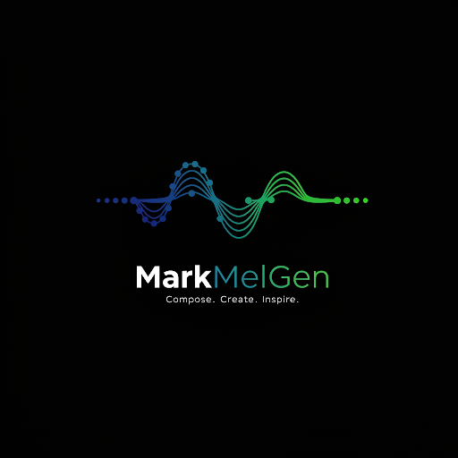
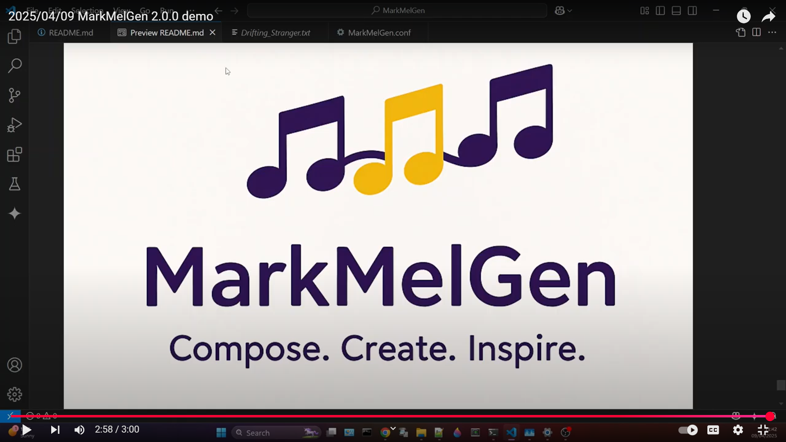
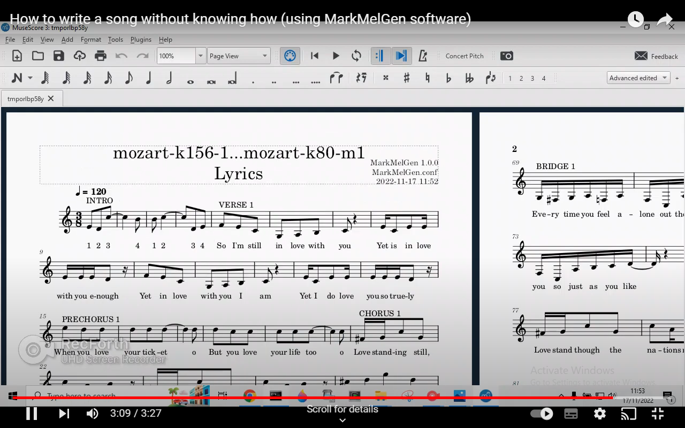
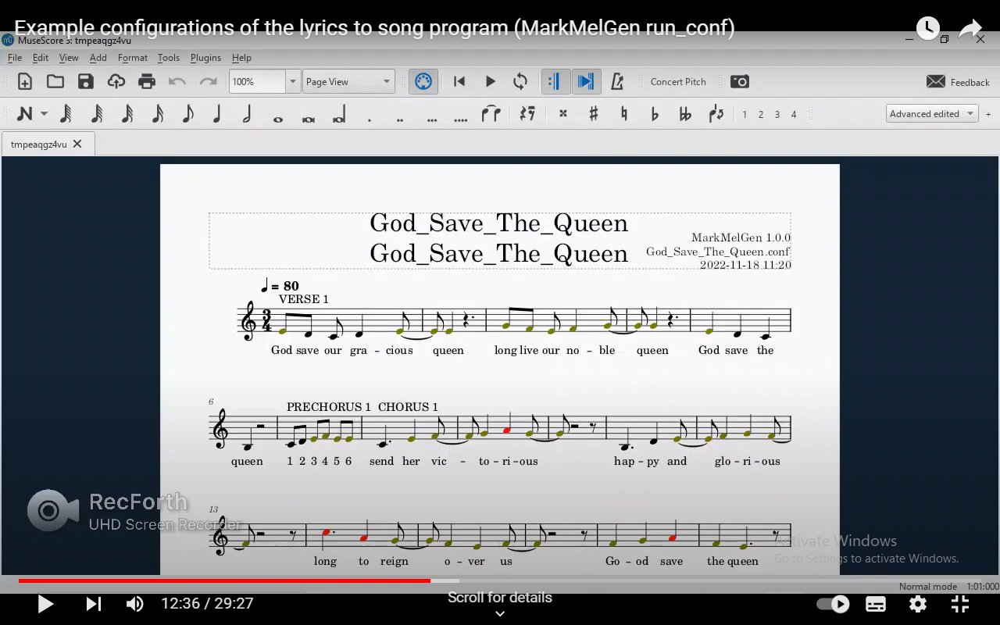
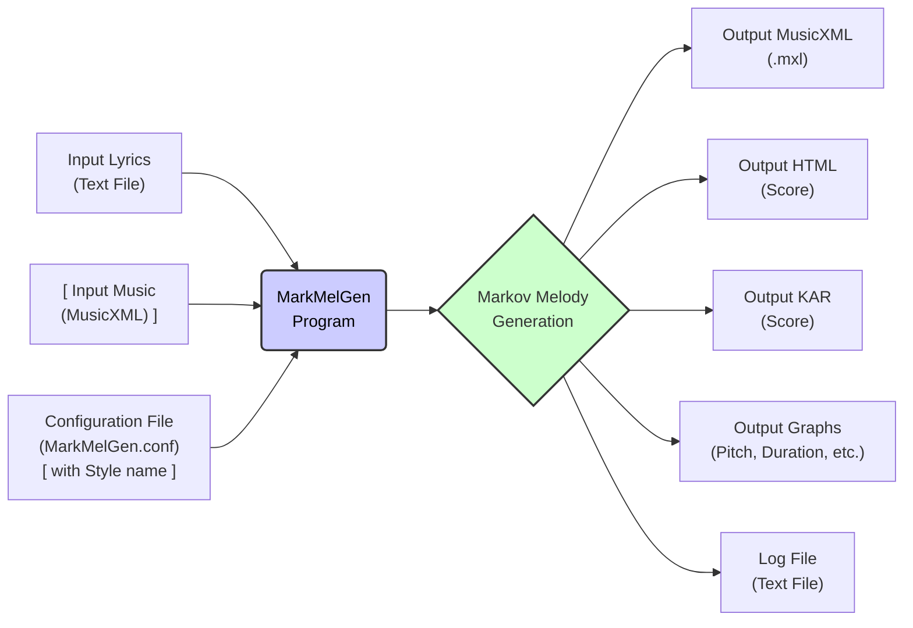

# MarkMelGen 2.0.0


MarkMelGen is a Markov Melody Generation python program that 
given lyrics and configuration data, uses melody styles to 
create tunes for the supplied words.

MarkMelGen allows the user to add some structure with lyrical sections (intro, verse, prechorus, chorus, solo, bridge, or outro) 
and line functions (such as copy, transpose, invert and reverse)
to develop the Markov melodies and so compose more memorable songs.

MarkMelGen demonstration video for v2.0.0:

[](https://www.youtube.com/watch?v=hHcUs8nMzY0 "MarkMelGen 2.0.0 video")

MarkMelGen demonstration video for v1.0.0:

[](https://www.youtube.com/watch?v=cAxGzUqxgFw "MarkMelGen 1.0.0 video")

MarkMelGen has been tested on: 
* Windows 11 24H2 (OS Build 26100.3476)
  - MarkMelGen 2.0.0 with MuseScore 4.5.1, Python 3.13.24, mido 1.3.3, music21 9.5.0, numpy 1.26.4, showscore 0.1.4
    (where versions obtained using on Windows: Start winver, MarkMelGen: first line of standard output or top right of output MusicXML, MuseScore: Help About..., python: python --version music21: pip list)
* macOS Monterey 12.0.1 
  - MarkMelGen 2.0.0 with MuseScore 3.6.2, Python 3.13.2, mido 1.3.3, music21 v 9.5.0, numpy 1.26.4, showscore 0.1.4 
* Ubuntu 22.04.3 LTS
  - MarkMelGen 2.0.0 with MuseScore 3.2.3, Python 3.10.12 (in venv), music21 v 9.1.0
  (where versions obtained using Ubuntu desktop top right icons, Settings, About. MuseScore: Help About... python: Terminal: Ctrl+Alt+T, python3 --version, music21: pip3 list)

**Table of Contents**

1. [WindowsInstall](#WindowsInstall)
2. [macOSInstall](#macOSInstall)
3. [UbuntuInstall](#UbuntuInstall)
4. [Configuration](#Configuration)
5. [InputLyrics](#InputLyrics)
6. [InputMusic](#InputMusic)
7. [Output](#Output)
8. [Tools](#Tools)
9. [Workflow](#Workflow)
10. [Troubleshooting](#Troubleshooting)


*Note: GitHub has a full table of contents with links in the header icon (top left of the readme.md).*

Here is a simple diagram illustrating the main input and output flow of **MarkMelGen**:

```plaintext
+-------------------+       +-------------------+       +-------------------------------------+
|                   |       |                   |       |                                     |
|   Input Lyrics    |       | [ Input Music     |       |   Configuration                     |
| (e.g., lyrics.txt)|       | e.g., melody.mxl ]|       |   e.g. My.conf with                 |
|                   |       |                   |       | USE_STYLES = ['classical_baroque_7']| 
+-------------------+       +-------------------+       +-------------------------------------+
          |                           |                           |
          +-------------------------------------------------------+
                                      |
                                      v
                           +-----------------------+
                           |                       |
                           |     MarkMelGen        |
                           | (Markov Melody Gen.)  |
                           |                       |
                           +-----------------------+
                                      |
                                      v
                           +-----------------------+
                           |                       |
                           |    Generated Song     |
                           | (Lyrics + Melody in   |
                           |  MusicXML & kar       |
                           |  format)              |                   
                           +-----------------------+
```

### Explanation:
1. **Inputs**:
   - **Input Lyrics**: A text file containing lyrics with section headers (e.g., verse, chorus).
   - **Input Music**: A MusicXML file containing a melody or multiple melodies.
   - **Configuration**: A `.conf` file specifying settings like tempo, time signature, and style.

2. **Processing**:
   - MarkMelGen uses Markov chains and the provided inputs to generate melodies that match the lyrics and configuration.

3. **Output**:
   - A MusicXML file containing the generated song with lyrics and melody, ready for playback or further editing in software like MuseScore.


**MarkMelGen help**

    python MarkMelGen.py -h

    usage: MarkMelGen.py [-h] [-c CONFIG] [--display-graphs] [--display-html] [--display-mxl] [--display-kar] [-l {DEBUG,INFO,WARNING,ERROR,CRITICAL}] [-o OVERRIDE] [--create-style CREATE_STYLE] [--list-styles]
                        [-v]

    MarkMelGen: A tool for generating Markov melodies.

    options:
    -h, --help            show this help message and exit
    -c, --config CONFIG   config file path (default: MarkMelGen.conf)
    --display-graphs      Display graphs
    --display-html        Display HTML score
    --display-mxl         Display MuseScore MXL score
    --display-kar         Display MuseScore KAR score
    -l, --loglevel {DEBUG,INFO,WARNING,ERROR,CRITICAL}
                            Set the logging level (default: INFO)
    -o, --override OVERRIDE
                            Override certain configuration settings in the format 'section.key=value'. Can be specified multiple times. e.g. -o paths.INPUT_LYRICS_PATH=input\lyrics\ -o
                            filenames.INPUT_LYRICS_FILENAME=Drifting_Stranger.txt -o markmelgen.DISPLAY_GRAPHS=True -o markmelgen.TEMPO_BPM=90.0 -o markmelgen.TIME_SIG_WANTED='6/8' -o
                            markmelgen.DURATION_SET=['0.5','1.25','1.5'] -o markmelgen.USE_STYLES=['early_jazz_1','early_jazz_2']
    --create-style CREATE_STYLE
                            Path to input music directory (must be a directory)
    --list-styles         List available styles and exit
    -v, --version         Show version and exit

---
## WindowsInstall
### MarkMelGen Installation instructions for Windows
Pre-requisites for MarkMelGen include MuseScore, Python, Music21.

### MuseScore Windows installation
Browse to https://musescore.org/en/download
 
Download for Windows and run installer.
### Python Windows installation
 1. Firstly check python version required by latest Music21.
 See 
    * https://github.com/cuthbertLab/music21/releases then search for python
        
            e.g. "Music21 v.9.3 is the first release version to officially support both Python 3.12 and Python 3.13"

* For example
  * Python 3.13.2 worked for me with music21 version 9.5.0 on a Windows 11 x64-based PC after I downloaded and installed Visual Studio Build Tools:
https://visualstudio.microsoft.com/visual-cpp-build-tools/ and selected C++ build tools during installation.
  * Python 3.12.6 worked for me with music21 version 9.3.0
  * Python 3.11.4 worked for me with music21 version 9.1.0
  * Python 3.10.8 worked for me with music21 version 8.1.0 and 9.1.0
  * Python 3.10.0 did not work for me with music21 version 7.1.0 (numpy not compatible)
  * Python 3.9.6 worked for me with music21 versions 6.7.1 and 7.1.0   
  
(if you have an old version of python you don't need then Start, search, add, click on Add or remove programs, click on the old Python version, Uninstall, Uninstall, Close. You may need to manually remove the old version from your path: e.g. Start, search, env, Edit the system environment variables, Environment Variables..., User variables, Path, Edit..., select line with the old python scripts e.g ...Python39\Scripts\, Delete, select old python e.g. ...Python39\, Delete, OK x3)

  

2. Browse to https://www.python.org/downloads/windows
    
    Download desired version (may not be the latest) for your machine e.g. Windows installer (64-bit), and run.
    
    Select "Add Python to PATH". Install.


3. Check the new Python works: Start, search, cmd, click on Command Prompt, type:
   
    python --version

    Expect the version to be displayed e.g. Python 3.10.8

### Music21 Windows installation
 
1. Music21 Installation details at https://www.music21.org/music21docs/installing/installWindows.html

    At command prompt:

    pip install music21

2. Check music21 version installed with:

   pip list

3. Configure with (press return to accept defaults):

   python -m music21.configure

if you have problems and want to try different versions. Uninstall music21 with:

   pip uninstall music21

To upgrade music21 at a later date to the latest version, 'pip uninstall music21' then 'pip install music21' again.

### Other Python libraries Windows installation

pip install mido
pip install showscore

### MarkMelGen Windows installation

#### Install MarkMelGen on Windows
 Download release zip to desired directory for MarkMelGen e.g. C:\Users\paul\Music and
 unzip with right click Extract All ... 
 (this creates a folder with the name of the zip file).
#### Run MarkMelGen on Windows 

 In a Command Prompt window change to install directory and perform an example run of MarkMelGen e.g.:

    cd C:\Users\paul\Music\MarkMelGen
    run


 After the melody has been generated, then MuseScore should open.  
 Press Space to start or stop playback.
 
When finished, Close MuseScore.


#### Run MarkMelGen demonstration configuration files on Windows

 In a Command Prompt window type run_conf to run this build's example configuration files in the conf directory e.g.:

    run_conf


Several runs of MarkMelGen will occur. Follow instructions to press Enter or close windows to continue.  A Logfile is written and music XML files created in the output directory.
Provided MuseScore is installed to the default location, recent output should be displayed in MuseScore.
 
When finished, Close MuseScore.


MarkMelGen configurations demonstration video:

This shows a range of configurations with different lyrics and music. 
Some are of well known songs where the tune is recreated from the markov chains. 
This shows the limitations when using one piece of input music. 
Using several input music files produces a less recognisable composition.

[](https://www.youtube.com/watch?v=NSwdJdkqDRk "MarkMelGen configurations video")


#### Run MarkMelGen test files

 In a Command Prompt window type run_conf_test to run the configuration files in the conf directory e.g.:

    run_conf_test


---

## macOSInstall
### MarkMelGen Installation instructions for macOS
Pre-requisites for MarkMelGen include MuseScore, Python, Mido and Music21.

### MuseScore on macOS
See https://musescore.org/en/handbook/3/install-macos  

 1. Download for mac e.g. 3.6.2                                     from https://musescore.org/en/download
 2. Double-click the DMG file to mount the disk image.
 3. Drag and drop the MuseScore icon to the Applications folder icon.
 4. Launch MuseScore from the Applications folder to complete setup.

### Python on macOS:
 1. Firstly check python version required by Music21.
see https://www.music21.org/music21docs/installing/installMac.html
e.g. go to https://www.python.org/downloads and getting the latest version e.g. Python 3.13.2 universal installer

 2. Use https://docs.python.org/3/using/mac.html and https://www.python.org/downloads/macos/
 3. To check the installed version of python, click the Launchpad icon in the Dock, type Terminal in the search field, then click Terminal. Then type:
    

    python3 --version

    e.g. Python 3.13.2


### Music21 on macOS
 

1. Install Music21. In a Terminal type:


        pip3 install music21

* For example python 3.13.2 worked for me with music21 version 9.5.0 on macOS Monterey 12.0.1 by: 
  * pip3 install music21
  * * Expect above to fail Downloading numpy, on the popup window, click Download developer software.
  * * The Software was installed. Done. Open new terminal
  * python3 -m pip install --upgrade pip
  * pip3 install music21     


2. Check music21 version installed with:

       pip3 list

3. Configure music21 with (press return to accept defaults):

   python3 -m music21.configure

### Mido and showscore macOS installation

* pip3 install mido
* pip3 install showscore

#### Install MarkMelGen on macOS
 Download release zip to desired directory for MarkMelGen and unzip by double-clicking on the zipped file .
#### Run MarkMelGen on macOS

 In command prompt change to install directory, make run files executable and run MarkMelGen e.g.:

 ```  
 cd ~/MarkMelGen
 chmod a+x run*
 ./run.sh
```


MuseScore should open.  
 Press Space to start or stop playback..
 
When finished:
* if you are running with graphs, on the Dock on the graph icon, click and close all the Windows.
* Close MuseScore.


#### Run MarkMelGen demonstration configuration files on macOS

 In a Command Prompt window type run_conf to run the configuration files in the conf directory e.g.:

    ./run_conf.sh

Several runs of MarkMelGen will occur. Follow instructions to press Enter or close windows to continue.  A Logfile is written and music XML files created in the output directory.
Provided MuseScore is installed to the default location, output should be displayed in MuseScore.
 
When finished, close any graph and MuseScore windows.


#### Run MarkMelGen test files on macOS

 In a Command Prompt window type run_conf_test to run the configuration files in the conf directory e.g.:


    ./run_conf_test.sh

To see the run_conf_test file results, go to the output folder in your MarkMelGen install directory.
Open desired musicxml file in MuseScore. When finished, Close MuseScore.

---

## UbuntuInstall

### MarkMelGen Installation instructions for Ubuntu
Pre-requisites for MarkMelGen include MuseScore, Python, Mido and Music21.

### MuseScore on Ubuntu
 1. Install MuseScore via the command line:

    sudo add-apt-repository ppa:mscore-ubuntu/mscore3-stable

    sudo apt-get update

    sudo apt install musescore3


Note: If you use Ubuntu Software to install MuseScore, music21 will not find the MuseScore snap location. 

2. Activities, search MuseScore, click on MuseScore to complete setup.

### Python on Ubuntu:
 1. Firstly check python version required by Music21.
see https://www.music21.org/music21docs/installing/installLinux.html
in October 2021 this stated Music21 requires Python 3.7+.

 2. Check default installed version of python Ctrl+Alt+T
    

    python3 --version

    e.g. Python 3.10.12

The default python on Ubuntu 22.04.03 is compatible.


### Music21 on Ubuntu
 
1. If the package installer for Python (pip3) is not yet installed, in terminal :

       sudo apt install python3-pip


2. Install Music21


        pip3 install music21

3. or to upgrade music21 e.g. from 7.1.0 to 8.1.0

        pip3 uninstall music21
        pip3 install music21


4. Check music21 version installed with:

       pip3 list

### Mido & showscore Ubuntu installation

    pip3 install mido
    pip3 install showscore

#### Install MarkMelGen on Ubuntu
 Download release zip to desired directory for MarkMelGen and unzip.
#### Run MarkMelGen on Ubuntu

 In command prompt change to install directory and run MarkMelGen e.g.:

 ```  
 cd ~/pycharm
 chmod a+x run*
 ./run.sh
```


MuseScore should open.  
 Press Space to start or stop playback..
 
When finished:
* if you are running with graphs, on the left sidebar (unity launcher) on the Image Viewer icon, right click, Quit 8 Windows.
* Close MuseScore.


#### Run MarkMelGen demonstration configuration files on Ubuntu

 In a Command Prompt window type run_conf to run the configuration files in the conf latest build directory e.g.:

    ./run_conf.sh


Several runs of MarkMelGen will occur. Follow instructions to press Enter or close windows to continue.  A Logfile is written and music XML files created in the output directory.
Provided MuseScore is installed to the default location, output should be displayed in MuseScore.
 
When finished, close any graph and MuseScore windows.


#### Run MarkMelGen test files on Ubuntu

 In a Command Prompt window type run_conf_test to run the configuration files in the conf directory e.g.:


    ./run_conf_test.sh

To see the run_conf_test batch file results, Start File Explorer and go to the output folder in your MarkMelGen install directory.
Double-click on a musicxml file to open it in MuseScore. When finished, Close MuseScore.


---

## Configuration

Initial configuration file sections apply to the whole song.
Alternative examples are commented out.  The commented lines begin with a #.
The configuration file can be edited by adding a # 
to comment out an initial value, and then
remove the comment # on the desired alternative value.


Later sections apply to individual song sections i.e. [song_intro] to [song-outro] sections.
All values in these individual song sections can be commented out,
or individual entries can be uncommented.

e.g. MarkMelGen.conf

    # MarkMelGen.conf
    # Configuration file for MarkMelgen 2.0.0 python configparser

    # Configuration files may include comments, prefixed by specific characters (# by default)
    # A configuration file consists of sections, each led by a [section] header,
    # followed by key/value (or option/value) entries separated by a specific string (= by default).
    # By default, section names are case sensitive but keys are not.
    # Leading and trailing whitespace is removed from keys and values.
    # Values can be omitted if the parser is configured to allow it.
    # if a single option appears twice there will be a DuplicateOptionError.


    [paths]
    # The directories used. If blank use current working directory.

    # INPUT_LYRICS_PATH =
    INPUT_LYRICS_PATH = input/lyrics/

    # INPUT_MUSIC_PATH =
    # INPUT_MUSIC_PATH = input/music/
    # INPUT_MUSIC_PATH = input/music/bach/
    # INPUT_MUSIC_PATH = input/music/beethoven/
    # INPUT_MUSIC_PATH = input/music/chopin/
    # INPUT_MUSIC_PATH = input/music/essenFolksong/
    INPUT_MUSIC_PATH = input/music/mozart/
    # INPUT_MUSIC_PATH = input/music/rachmaninov/
    # INPUT_MUSIC_PATH = input/music/trecento/

    INPUT_STYLE_PATH = input/style/
    # INPUT_STYLE_PATH = private/input/test_styles/

    # OUTPUT_PATH =
    OUTPUT_PATH = output/


    [filenames]
    # The input filenames used.

    INPUT_LYRICS_FILENAME = Lyrics.txt
    # INPUT_LYRICS_FILENAME = lovePopHappy.txt

    # if INPUT_MUSIC_FILENAME is blank then MarkMelGen processes all the .mxl files in the INPUT_MUSIC_PATH directory.
    # INPUT_MUSIC_FILENAME = Music.mxl
    INPUT_MUSIC_FILENAME =


    [markmelgen]
    # The key options for the MarMelGen program.

    BEAT_PLACEMENTS_DENIED_SET = []
    # BEAT_PLACEMENTS_DENIED_SET = ['Fraction(1, 3)', 'Fraction(2, 3)', 'Fraction(1, 4)', 'Fraction(3, 4)']

    BEAT_PLACEMENTS_DENOMINATOR_DENIED_SET = []
    # BEAT_PLACEMENTS_DENOMINATOR_DENIED_SET = [ 5, 6, 7, 8, 9 ]

    # BEAT_PLACEMENT_DENOMINATOR_MAXIMUM_ALLOWED is an integer >= 0, 
    # that limits the allowed fractions of a beat to the integer given,
    # if such a beat is in the input music, e.g. 0 means no limit, 1 may allow mostly quarter notes, 2 allow beats on half a quarter i.e. eighth beats, 
    # etc as you increase the integer the result will approach the same as if 0 (no limit) was used.
    # BEAT_PLACEMENT_DENOMINATOR_MAXIMUM_ALLOWED = 0
    # BEAT_PLACEMENT_DENOMINATOR_MAXIMUM_ALLOWED = 2
    # BEAT_PLACEMENT_DENOMINATOR_MAXIMUM_ALLOWED = 3
    BEAT_PLACEMENT_DENOMINATOR_MAXIMUM_ALLOWED = 4
    # BEAT_PLACEMENT_DENOMINATOR_MAXIMUM_ALLOWED = 5
    # BEAT_PLACEMENT_DENOMINATOR_MAXIMUM_ALLOWED = 6
    # BEAT_PLACEMENT_DENOMINATOR_MAXIMUM_ALLOWED = 10


    # CADENCE_ALTERNATE_PHRASE_END - if True a cadence is forced on every second line.
    CADENCE_ALTERNATE_PHRASE_END = False
    # CADENCE_ALTERNATE_PHRASE_END = True

    # CADENCE_DUR_MIN - the minimum duration of the cadence final note.
    CADENCE_DUR_MIN = 3.0

    # CADENCE_SECTION_END - if True a cadence is forced on every section end.
    CADENCE_SECTION_END = False
    # CADENCE_SECTION_END = True

    # CADENCE_TONE_FREQUENCY is a list of cadence tone name and frequency pairs, where the tone name is A to G, and the frequency count is 1 or more.
    # if not blank then it overrides the derived Cadence Markov Chain.
    # Note: A cadence may be considered as "weak" or "strong" depending on the impression of finality it gives.
    CADENCE_TONE_FREQUENCY =
    #
    # Examples of CADENCE_TONE_FREQUENCY for modes.
    # Mode A (Aeolian - minor) -----------------------------------------------------------------------------------------
    # A5 (making a chord from the cadence notes)
    # CADENCE_TONE_FREQUENCY = [['A', 9], ['E', 6]]
    # Am
    # CADENCE_TONE_FREQUENCY = [['A', 4], ['C', 5], ['E', 11]]
    # A7
    # CADENCE_TONE_FREQUENCY = [['A', 6], ['E', 3], ['G', 2]]
    # Am7s4
    # CADENCE_TONE_FREQUENCY = [['A', 3], ['C', 2], ['D', 2], ['E', 2], ['G', 4]]
    # Am and Em
    # CADENCE_TONE_FREQUENCY = [['A', 6], ['B', 1], ['C', 1], ['E', 4], ['G', 2]]
    # Am and Em7
    # CADENCE_TONE_FREQUENCY = [['A', 3], ['B', 7], ['C', 4], ['E', 2], ['G', 1]]
    # Mode B (Locrian - discordant tri-tone) --------------------------------------------------------------------------
    # CADENCE_TONE_FREQUENCY = [['B', 6], ['F', 3]]
    # Mode C (Ionian - major) -----------------------------------------------------------------------------------------
    # C9
    # CADENCE_TONE_FREQUENCY = [['C', 1], ['D', 2], ['E', 5], ['G', 2]]
    # C9
    # CADENCE_TONE_FREQUENCY = [['C', 2], ['D', 1], ['F', 2], ['G', 2]]
    # C
    # CADENCE_TONE_FREQUENCY = [['A', 1], ['C', 5], ['D', 1],  ['E', 2], ['F', 1], ['G', 3]]
    # C
    # CADENCE_TONE_FREQUENCY = [['B', 1], ['C', 6], ['D', 2],  ['E', 1], ['F', 2], ['G', 3]]
    # Mode D (Dorian - serious,	any feeling	happy, taming the passions) -----------------------------------------------
    # D9
    # CADENCE_TONE_FREQUENCY = [['A', 3], ['D', 10], ['E', 8], ['G', 1]]
    # D
    # CADENCE_TONE_FREQUENCY = [['A', 3], ['C', 1], ['D', 4], ['G', 1]]
    # Dm & Am
    # CADENCE_TONE_FREQUENCY = [['A', 7], ['C', 7], ['D', 3], ['E', 9], ['F', 2]]
    # Mode E (Phrygian - mystic, vehement, inciting anger) ------------------------------------------------------------
    # Em
    # CADENCE_TONE_FREQUENCY = [['E', 8], ['G', 4]]
    # Em7
    # CADENCE_TONE_FREQUENCY = [['B', 3], ['D', 1], ['E', 4], ['G', 1]]
    # Mode F (Lydian - happy, happy, happy) ---------------------------------------------------------------------------
    # CADENCE_TONE_FREQUENCY = [['A', 1], ['C', 1], ['F', 4], ['G', 1]]
    # Mode G (Mixolydian - angelical, of youth, uniting pleasure and sadness) -----------------------------------------
    # CADENCE_TONE_FREQUENCY = [['A', 1], ['D', 3], ['E', 1], ['G', 4]]
    #
    # Test example with all pitch frequency=1
    # CADENCE_TONE_FREQUENCY = [['C-', 1], ['C', 1], ['C#', 1], ['D-', 1], ['D', 1], ['D#', 1], ['E-', 1], ['E', 1], ['E#', 1], ['F-', 1], ['F', 1], ['F#', 1], ['G-', 1], ['G', 1], ['G#', 1], ['A-', 1], ['A', 1], ['A#', 1], ['B-', 1], ['B', 1], ['B#', 1]]

    # Display graphs of pitch, pitch class, durations and a piano roll.
    # DISPLAY_GRAPHS = True
    DISPLAY_GRAPHS = False

    # Display the html score in browser
    # DISPLAY_HTML = True
    DISPLAY_HTML = False

    # Display the score in another application (e.g. MuseScore).
    DISPLAY_MXL = True
    # DISPLAY_MXL = False

    # Display the score in another application (e.g. MuseScore).
    # DISPLAY_KAR = True
    DISPLAY_KAR = False

    # DURATION_EQ is is a list of duration name and frequency factor pairs, and the frequency multiplier factor is a positive real number > 0.0.
    # if not blank then it allows the Markov selection of each duration to be increased when the frequency multiplier factor is > 1.0 or decreased when > 0.0 and < 1.0.
    # Only durations present in the input music can be adjusted.
    DURATION_EQ =
    #
    # Examples of DURATION_EQ to bias desired durations without losing others completely
    # to increase half notes, and reduce whole notes:
    #DURATION_EQ = [['0.5', 100.0], ['1.0', 0.5]]
    # to increase quarter-note triplets, and reduce whole notes:
    #DURATION_EQ = [['Fraction(1, 3)', 130.0], ['1.0', 0.5]]

    # DURATION_SET - a set of musical durations, ordered by length, starting on shortest duration.
    # A duration can only be picked if it appears in the INPUT_MUSIC (see the Input histogram Quarter Length graph).
    # Note: if you want a tuplet (e.g. '1.3') in your DURATION_SET ensure:
    #       DUR_RATIONAL is False globally or in desired song section;
    #       Tuplet is within DUR_LEAST - DUR_LONGEST.
    DURATION_SET = []
    # DURATION_SET = ['0.25', '0.5']
    # DURATION_SET = ['0.25', '0.5', '0.75', '1.0', '1.5', '2.0', '3.0', '4.0']
    # DURATION_SET = ['1/6', '1/3', '2/3', '1.0']

    # DUR_LEAST - The minimum duration. 0 = not checked.
    # Use a fraction if the duration is inexpressible exactly as a float.  A fraction is defined with slash e.g. 2/3
    # DUR_LEAST = 0
    # DUR_LEAST = 1
    DUR_LEAST = 0.25
    # DUR_LEAST = 1/6

    # DUR_LONGEST - The maximum duration. 0 = not checked.
    # DUR_LONGEST = 0
    DUR_LONGEST = 2.0
    # DUR_LONGEST = 2/3

    # DUR_PREV_DIFF - compare duration with previous duration.
    # e.g. where 2, duration is valid when >= 1/2 previous and <= 2 x previous etc ,
    # where 0 or <= 1, do not compare with previous duration.
    # DUR_PREV_DIFF = 0
    # DUR_PREV_DIFF = 2.0
    DUR_PREV_DIFF = 4.0

    # DUR_RATIONAL if True any simple rational (beat divides into 2) duration is valid. Only simple beat placements valid. This can avoid output corruption.
    # DUR_RATIONAL if False irrational (e.g. beat divides into 3) duration is valid. This can cause output corruption.
    DUR_RATIONAL = True
    # DUR_RATIONAL = False

    # DUR_TUPLET if True any complex (e.g. beat divides into 3) duration is valid. DUR_RATIONAL and DUR_TUPLET cannot both be True
    DUR_TUPLET = False
    # DUR_TUPLET = True

    # INSTRUMENT
    # Full list of instruments at https://raw.githubusercontent.com/cuthbertLab/music21/master/music21/instrument.py
    # right click Save as... and search for instrumentName e.g.
    # find "self.instrumentName =" instrument.py
    # find "self.instrumentName =" instrument.py | find "Piano"
    # INSTRUMENT = Piano
    # INSTRUMENT = Accordion
    # INSTRUMENT = Acoustic Bass
    # INSTRUMENT = Acoustic Guitar
    # INSTRUMENT = Alto
    # INSTRUMENT = Alto Saxophone
    # INSTRUMENT = Banjo
    # INSTRUMENT = Baritone
    # INSTRUMENT = Baritone Saxophone
    # # voice.bass
    # INSTRUMENT = Bass
    # INSTRUMENT = Bassoon
    # INSTRUMENT = Bass Trombone
    # INSTRUMENT = Brass
    # INSTRUMENT = Celesta
    # INSTRUMENT = Clarinet
    # INSTRUMENT = Clavichord
    # INSTRUMENT = Contrabass
    # INSTRUMENT = Contrabassoon
    # INSTRUMENT = Dulcimer
    # INSTRUMENT = Electric Bass
    # INSTRUMENT = Electric Guitar
    # INSTRUMENT = Electric Piano
    # INSTRUMENT = English Horn
    # INSTRUMENT = Flute
    # INSTRUMENT = Glockenspiel
    # INSTRUMENT = Guitar
    # INSTRUMENT = Harmonica
    INSTRUMENT = Harp
    # INSTRUMENT = Kalimba
    # INSTRUMENT = Koto
    # INSTRUMENT = Lute
    # INSTRUMENT = Marimba
    # INSTRUMENT = Oboe
    # INSTRUMENT = Ocarina
    # INSTRUMENT = Pan Flute
    # INSTRUMENT = Piccolo
    # INSTRUMENT = Recorder
    # INSTRUMENT = Reed Organ
    # INSTRUMENT = Saxophone
    # INSTRUMENT = Shamisen
    # INSTRUMENT = Sitar
    # INSTRUMENT = Soprano
    # INSTRUMENT = Soprano Saxophone
    # INSTRUMENT = Tenor
    # INSTRUMENT = Tenor Saxophone
    # INSTRUMENT = Timpani
    # INSTRUMENT = Trombone
    # INSTRUMENT = Trumpet
    # INSTRUMENT = Tuba
    # INSTRUMENT = Tubular Bells
    # INSTRUMENT = Ukulele
    # INSTRUMENT = Vibraphone
    # INSTRUMENT = Violin
    # INSTRUMENT = Violoncello
    # INSTRUMENT = Voice
    # INSTRUMENT = Xylophone
    # # ----------------------------  percussion - unpitched (not melodic, but fun!)
    # # On MuseScore 3.6.2 you can change instruments by right clicking a staff,
    # # choose staff/part properties, click "Change instruments", select the new instrument and click OK.
    # INSTRUMENT = Castanets
    # INSTRUMENT = Maracas

    # MAX_PHRASE_REST - when analysing rests, ignore rests longer than MAX_PHRASE_REST e.g. ignore initial rests, instrumental solo rests, end of song rests
    # MAX_PHRASE_REST = 4.0
    MAX_PHRASE_REST = 8.0

    # REST_NOTE_LINE_OFFSET  if not blank then force given offset for each line. = 0.0 is first beat, 3.0 means start lyric on fourth beat.
    # REST_NOTE_LINE_OFFSET =
    REST_NOTE_LINE_OFFSET = 0.0


    # TEMPO_BPM when 0.0, tempo is taken from INPUT_MUSIC. If INPUT_MUSIC has no tempo, default to 120.0 otherwise use given tempo in quarter note beats per minute
    # TEMPO_BPM = 0.0
    # TEMPO_BPM = 80.0
    # TEMPO_BPM = 90.0
    # TEMPO_BPM = 100.0
    # TEMPO_BPM = 110.0
    # TEMPO_BPM = 120.0
    TEMPO_BPM = 130.0
    # TEMPO_BPM = 140.0


    # TIME_SIG_WANTED if not blank then force given time signature e.g. 4/4
    # TIME_SIG_WANTED =
    # TIME_SIG_WANTED = '3/4'
    TIME_SIG_WANTED = '4/4'
    # TIME_SIG_WANTED = '12/8'

    # Tone filters

    # TONE_ASCENT True triggers a sequence of notes rising in pitch when TONE_RANGE_BOTTOM is reached until the middle of the tone range is achieved.
    TONE_ASCENT = False
    # TONE_ASCENT = True

    # TONE_ASCENT_MIN_INTERVAL - (>=2) after TONE_ASCENT_TRIGGERED, sets minimum semitone interval from previous tone
    # 2 gives runs up scale, 3 gives ascent leaps, 4 gives ascent chord arpeggio
    # TONE_ASCENT_MIN_INTERVAL = 2
    TONE_ASCENT_MIN_INTERVAL = 5

    # TONE_ASCENT_TRIGGER_EVERY_N_TIMES - only trigger the ascent every Nth time the trigger tone occurs
    TONE_ASCENT_TRIGGER_EVERY_N_TIMES = 1
    # TONE_ASCENT_TRIGGER_EVERY_N_TIMES = 2

    # TONE_DESCENT True triggers a cascade down when TONE_RANGE_TOP is reached until the middle of the tone range is achieved.
    TONE_DESCENT = False
    # TONE_DESCENT = True

    # TONE_DESCENT_MAX_INTERVAL - (>=2) after TONE_DESCENT_TRIGGERED, sets maximum semitone interval from previous tone
    # 2 gives runs down scale, 3 gives descent leaps, 4 gives descent chord arpeggio
    TONE_DESCENT_MAX_INTERVAL = 2
    # TONE_DESCENT_MAX_INTERVAL = 5

    # TONE_DESCENT_TRIGGER_EVERY_N_TIMES - only trigger the descent every Nth time the trigger tone occurs
    TONE_DESCENT_TRIGGER_EVERY_N_TIMES = 1
    # TONE_DESCENT_TRIGGER_EVERY_N_TIMES = 4

    # TONE_EQ is is a list of tone name and frequency factor pairs, where the tone name is A to G, and the frequency multiplier factor is a positive real number > 0.0.
    # # if not blank then it allows the Markov selection of each pitch to be increased when > 1.0 or decreased when > 0.0 and < 1.0.
    TONE_EQ =
    #
    # Examples of TONE_EQ to simulate modes.
    # Note: here a "Mode" is a type of musical scale defined by their starting primary pitch (a final) or tonic.
    # The modal final note functions as a relational center. The dominant tone of a mode is a fifth above the final.
    # Mode A (Aeolian - minor) -----------------------------------------------------------------------------------------
    #TONE_EQ = [['A', 4.0], ['E', 3.0]]
    # Mode B (Locrian - discordant tri-tone) --------------------------------------------------------------------------
    # TONE_EQ = [['B', 4.0], ['F', 3.0]]
    # Mode C (Ionian - major) -----------------------------------------------------------------------------------------
    # TONE_EQ = [['C', 4.0], ['G', 3.0]]
    # Mode D (Dorian - serious,	any feeling	happy, taming the passions) -----------------------------------------------
    # TONE_EQ = [['D', 4.0], ['A', 3.0]]
    # Mode E (Phrygian - mystic, vehement, inciting anger) ------------------------------------------------------------
    # TONE_EQ = [['E', 4.0], ['B', 3.0]]
    # Mode F (Lydian - happy, happy, happy) ---------------------------------------------------------------------------
    # TONE_EQ = [['F', 4.0], ['C', 3.0]]
    # Mode G (Mixolydian - angelical, of youth, uniting pleasure and sadness) -----------------------------------------
    # TONE_EQ = [['G', 4.0], ['D', 3.0]]
    #
    # Test example which boosts A, C and E, with other scale tones flat, and reduces accidentals:
    # TONE_EQ = [['C-', 0.1], ['C', 4.0], ['C#', 0.1], ['D-', 0.1], ['D', 1.0], ['D#', 0.1], ['E-', 0.1], ['E', 4.0], ['E#', 0.1], ['F-', 0.1], ['F', 1.0], ['F#', 0.1], ['G-', 0.1], ['G', 1.0], ['G#', 0.1], ['A-', 0.1], ['A', 4.0], ['A#', 0.1], ['B-', 0.1], ['B', 1.0], ['B#', 0.1]]

    # TONE_INTERVAL = smallest | largest | random.
    # The default is smallest interval between tones e.g. choose smallest C4 to B3, not largest C4 to B4
    TONE_INTERVAL = smallest
    # TONE_INTERVAL = largest
    # TONE_INTERVAL = random


    # TONES_ON_KEY and TONES_OFF_KEY are mutually exclusive. Only one can be True-------------------------------------------

    TONES_ON_KEY = True 
    TONES_OFF_KEY = False
    # Only notes within the scale will be considered valid. This forces the melody to stay within the key.

    # TONES_ON_KEY = False
    # TONES_OFF_KEY = False
    # This is the "unfiltered" mode. 
    # The Markov chains and note probabilities will be the primary factors in determining the pitches. 
    # The scale is not used as a filter. The TONE_SCALE_SET is used as a filter.


    # TONES_ON_KEY = False
    # TONES_OFF_KEY = True
    # Only notes outside the scale will be considered valid. This will create a very dissonant, "off-key" melody.

    # TONES_ON_KEY = True and TONES_OFF_KEY = True: This is an invalid combination and will cause the program to exit with an error.
    # End of TONES_ON_KEY and TONES_OFF_KEY are mutually exclusive. Only one can be True-------------------------------------------


    # TONE_PREV_INTERVAL - maximum number of semitones between notes.
    # 0 = Off, do not compare with previous tone
    # 1 caused hang together with TONE_SCALE_SET
    # 2-3 very limited melodic movement
    # 4 limited melodic movement
    # 5 - 6 lightly limited melodic movement
    # 7 normal melodic movement
    # 8 - 9 slightly jumpy melodic movement
    # >= 10  jumpy melodic movement, use with TONE_INTERVAL = largest
    TONE_PREV_INTERVAL = 0
    # TONE_PREV_INTERVAL = 4

    # TONE_RANGE_BOTTOM / TONE_RANGE_TOP - change to suit the desired vocal range.
    # Note: consider "tessitura" - the best notes in your range.
    # Note: The octave number changes at C, e.g. A3, B3, C4, D4, E4 etc. C4 is middle C.
    # Female
    # Soprano:	C4 to C6
    # TONE_RANGE_BOTTOM = C4
    # TONE_RANGE_TOP = C6
    # Mezzo-soprano: A3 to A5
    # TONE_RANGE_BOTTOM = A3
    # TONE_RANGE_TOP = A5
    # Contralto F3 to F5
    # TONE_RANGE_BOTTOM = F3
    # TONE_RANGE_TOP = F5
    # Male:
    # Tenor: B2 to B4
    # TONE_RANGE_BOTTOM = B2
    # TONE_RANGE_TOP = B4
    # Baritone: G2 to G4
    # TONE_RANGE_BOTTOM = G2
    # TONE_RANGE_TOP = G4
    # Bass: E2 to E4
    # TONE_RANGE_BOTTOM = E2
    # TONE_RANGE_TOP = E4
    # One octave range
    # TONE_RANGE_BOTTOM = C4
    # TONE_RANGE_TOP = B4
    # My Modal range (from free Piano tuner app)
    # TONE_RANGE_BOTTOM = C2
    # TONE_RANGE_TOP = C4
    # My Falsetto range - Falsetto (adult male head voice) is Italian for false soprano
    # TONE_RANGE_BOTTOM = C4
    # TONE_RANGE_TOP = C5
    # My Modal and Falsetto range
    # TONE_RANGE_BOTTOM = C2
    # TONE_RANGE_TOP = C5
    # Male-Female joint range
    # TONE_RANGE_BOTTOM = C2
    # TONE_RANGE_TOP = C6
    # Greensleeves range:
    # TONE_RANGE_BOTTOM = E4
    # TONE_RANGE_TOP = G5
    TONE_RANGE_BOTTOM = C3
    TONE_RANGE_TOP = C5

    # TONE_SCALE_SET defines the set of notes that are allowed. 
    # If this list is empty then all notes are allowed. 
    # If this list is populated, then only notes in this list are allowed.
    # TONE_SCALE_SET - a set of musical notes, ordered by fundamental frequency, starting on the note upon which the scale is built.
    # A pitch can only be picked if it appears in the INPUT_MUSIC (see the Input histogram Pitch Class graph).
    # TONE_SCALE_SET empty list (when not required):
    TONE_SCALE_SET = []
    # TONE_SCALE_SET with all tones (no tone filtering on input music). Note: filtering is enharmonic so no need to put C# and D- etc in filter:
    # TONE_SCALE_SET = ['C-', 'C', 'C#', 'D-', 'D', 'D#', 'E-', 'E', 'E#', 'F-', 'F', 'F#', 'G-', 'G', 'G#', 'A-', 'A', 'A#', 'B-', 'B', 'B#']
    # Six note Blues Scale built on A,      Degrees(relative to the A minor scale): 1 3 4 4# 5 7            Intervals: 3H-W-H-H-3H-W        Pitch classes: 6
    # TONE_SCALE_SET = ['A', 'C', 'D', 'D#', 'E', 'G']
    # Nine note Blues Scale built on C,     Degrees(relative to the C major scale): 1 2 3- 3 4 5 6 7- 7     Intervals: W-H-H-H-H-W-W-H-H    Pitch classes: 9
    # TONE_SCALE_SET = ['C', 'D', 'E-', 'E', 'F', 'G', 'A', 'B-', 'B']

    # TONE_SCALE_ON_ANHEMITONIC - if True, valid scale tones are [1, 2, 4, 5, 6]
    TONE_SCALE_ON_ANHEMITONIC = False
    # TONE_SCALE_ON_ANHEMITONIC = True

    # TONE_SCALE_ON_HEMITONIC - if True, valid scale tones are [1, 3, 4, 5, 7]
    TONE_SCALE_ON_HEMITONIC = False
    # TONE_SCALE_ON_HEMITONIC = True

    # The style options are used to select the style of the generated music.
    # if empty then no style is used. The INPUT_MUSIC_PATH / INPUT_MUSIC_FILENAME is used instead.
    # USE_STYLES = []
    USE_STYLES = ['classical_baroque_7']
    # USE_STYLES = ['classical_classical_2', 'classical_modern_1']
    # USE_STYLES=['classical_baroque_7','classical_classical_2','classical_modern_1','classical_renaissance_9','classical_romantic_1','classical_romantic_2','classical_romantic_5','early_jazz_1','early_jazz_2']


    # Song sections with optional key values.
    # uncomment (remove #) and change values if you want to change the options for a song section.
    # The song structure is determined by the section headers in the lyrics file.
    #
    # Example song structures:
    # AAA       verse-verse-verse
    # ABA       verse-chorus-verse or chorus-verse-chorus
    # AABA      verse-verse-chorus-verse
    # ABAB      verse-chorus-verse-chorus
    #
    # ABA form may be combined with AABA form, in compound AABA forms.
    # That means that every A section or B section can consist of more than one section (for example Verse-Chorus).
    # In that way the modern popular song structure can be viewed as a AABA form, where the B is the bridge.
    # AABA      {verse-chorus}{verse-chorus}-bridge-{verse-chorus}
    # or
    # ABABCB    verse-chorus-verse-chorus-bridge-chorus
    #
    # Other sections can be added e.g. intro, outro
    # ABBCBD    intro-{verse-chorus}{verse-chorus}-bridge-{verse-chorus}-outro
    #
    # The song structure is determined by the section headers in the lyrics file.
    # The Folowing sections, in square brackets, are expected by MarkMelGen:
    #[song_intro]
    #[song_verse]
    #[song_prechorus]
    #[song_chorus]
    #[song_solo]
    #[song_bridge]
    #[song_outro]


    [song_intro]
    # The introduction establishes melodic, harmonic or rhythmic material related to the main body of a piece.
    # The intro is usually only used once at the beginning of the piece.
    # Generally speaking, an introduction contains just music and no words.

    # intro key value example 1
    # DURATION_SET = ['0.25', '0.5', '0.75', '1.0', '2.0', '3.0', '4.0']
    # DUR_LEAST = 0.25
    # DUR_LONGEST = 4.0
    # DUR_PREV_DIFF = 12.0
    # DUR_RATIONAL = True
    # DUR_RATIONAL = True
    # DUR_TUPLET = False
    REST_NOTE_LINE_OFFSET = 0.0
    # TONES_ON_KEY = True
    # TONE_PREV_INTERVAL = 3
    # TONE_RANGE_BOTTOM = C5
    # TONE_RANGE_TOP = F5
    # TONE_SCALE_SET = ['C', 'D', 'E', 'F']

    [song_verse]
    # A verse is a repeated section of a song that typically features a new set of lyrics on each repetition.
    # The verse is usually played before the chorus.  It may be 64 or 32 beats long.

    # verse key value example 1
    # DURATION_SET = ['0.25', '0.5', '0.75', '1.0', '1.5', '2.0']
    # DUR_LEAST = 0.25
    # DUR_LONGEST = 2.0
    # DUR_PREV_DIFF = 8.0
    # DUR_RATIONAL = True
    # DUR_TUPLET = False
    # REST_NOTE_LINE_OFFSET = 0.0
    # TONES_ON_KEY = True
    # TONE_PREV_INTERVAL = 5
    # TONE_RANGE_BOTTOM = G3
    # TONE_RANGE_TOP = A4
    # TONE_SCALE_SET = ['A', 'B', 'C', 'D', 'E', 'G']


    [song_prechorus]
    # The prechorus connects the verse and chorus.
    # Also known as a "build", "channel", or "transitional bridge",
    # The prechorus typically uses the subdominant (usually built on the IV chord or ii chord),
    # which in the key of C Major would be an F Major or D minor chord.

    # prechorus key value example 1
    # DURATION_SET = ['0.25', '0.5', '0.75', '1.0', '1.5', '2.0', '4.0']
    # DUR_LEAST = 0.25
    # DUR_LONGEST = 4.0
    # DUR_PREV_DIFF = 5.333333333333333
    # DUR_RATIONAL = True
    # DUR_TUPLET = False
    REST_NOTE_LINE_OFFSET = 1.0
    # TONES_ON_KEY = True
    # TONE_PREV_INTERVAL = 5
    # TONE_RANGE_BOTTOM = G4
    # TONE_RANGE_TOP = E5
    # TONE_SCALE_SET = ['A', 'B', 'C', 'D', 'E', 'G']

    [song_chorus]
    # The chorus usually retains the same set of lyrics every time its music appears.
    # The chorus is the part that contains the hook or the "main idea" of a song's lyrics and music,
    # A refrain is a repetitive phrase or phrases that serve the function of a chorus lyrically,
    # but are not in a separate section or long enough to be a chorus.

    # chorus key value example 1
    # DURATION_SET = ['0.25', '0.5', '0.75', '1.0', '1.5', '2.0', '4.0']
    # DUR_LEAST = 0.25
    # DUR_LONGEST = 4.0
    # DUR_PREV_DIFF = 6.0
    # DUR_RATIONAL = True
    # DUR_TUPLET = False
    REST_NOTE_LINE_OFFSET = 2.0
    # TONES_ON_KEY = True
    # TONE_PREV_INTERVAL = 7
    # TONE_RANGE_BOTTOM = A4
    # TONE_RANGE_TOP = E5
    # TONE_SCALE_SET = ['A', 'B', 'C', 'D', 'E']

    [song_solo]
    # A solo or instrumental break is often found after the middle chorus part.
    # In pop music, there may be a guitar solo, or a solo may be performed by a synthesizer player or sax player.
    # A solo is a section designed to showcase an instrumentalist.

    # solo key value example 1
    # DURATION_SET = ['0.25', '0.5', '0.75', '2.0', '4.0']
    # DUR_LEAST = 0.25
    # DUR_LONGEST = 4.0
    # DUR_PREV_DIFF = 4.0
    # DUR_RATIONAL = True
    # DUR_TUPLET = False
    # REST_NOTE_LINE_OFFSET = 3.0
    # TONES_ON_KEY = True
    # TONE_PREV_INTERVAL = 2
    # TONE_RANGE_BOTTOM = B4
    # TONE_RANGE_TOP = D5
    # TONE_SCALE_SET = ['B', 'C', 'D']

    [song_bridge]
    # A bridge section usually appears after the second chorus.
    # A bridge is also known as a "middle eight". The bridge is usually only used once.
    # It contrasts with the verse usually ends on the dominant.
    # The bridge breaks up the repetitive pattern of the song and keep the listener's attention.
    # In a bridge, the pattern of the words and music change."

    # bridge key value example 1
    # DURATION_SET = ['0.25', '0.5', '0.75', '2.0', '4.0']
    # DUR_LEAST = 0.25
    # DUR_LONGEST = 4.0
    # DUR_PREV_DIFF = 4.0
    # DUR_RATIONAL = True
    # DUR_TUPLET = False
    REST_NOTE_LINE_OFFSET = 3.0
    # TONES_ON_KEY = True
    # TONE_PREV_INTERVAL = 2
    # TONE_RANGE_BOTTOM = B4
    # TONE_RANGE_TOP = D5
    # TONE_SCALE_SET = ['B', 'C', 'D']


    [song_outro]
    # The outro (also called a "coda") is usually only used once at the end.
    # The outro or conclusion is a way of finishing or completing the song.
    # It signals to the listeners that the song is nearing its close.
    # if a song just ended at the last bar of a section, such as on the last verse or the last chorus,
    # this might feel too abrupt for listeners.

    # outro key value example 1
    # DURATION_SET = ['0.25', '0.5', '0.75', '1.0', '2.0', '3.0', '4.0']
    # DUR_LEAST = 0.25
    # DUR_LONGEST = 4.0
    # DUR_PREV_DIFF = 12.0
    # DUR_RATIONAL = True
    # DUR_TUPLET = False
    # REST_NOTE_LINE_OFFSET = 0.0
    # TONES_ON_KEY = True
    # TONE_PREV_INTERVAL = 3
    # TONE_RANGE_BOTTOM = C5
    # TONE_RANGE_TOP = F5
    # TONE_SCALE_SET = ['C', 'D', 'E', 'F']


    


The style options USE_STYLES are used to select the style of the generated music, e.g. USE_STYLES = ['classical_baroque_7']. 
if empty i.e. USE_STYLES = [] then no style is used. The INPUT_MUSIC_PATH / INPUT_MUSIC_FILENAME is used instead. If the INPUT_MUSIC_FILENAME is blank then MarkMelGen processes 
all the music XML (.mxl) files in the INPUT_MUSIC_PATH directory.


Edit MarkMelGen.conf configuration as desired,
later sections are commented out with # at the beginning of the line.


* Use different configuration files to get different output e.g. on windows (otherwise replace python with python3 )

      python MarkMelGen.py -c conf/v2.0.0/early_jazz_1.conf


## InputLyrics

### Create an INPUT_LYRICS_FILENAME
 If you have some lyrics then manually add desired section names:
 intro, verse, prechorus, chorus, solo, bridge, or outro.
 otherwise you can use general AI sites.


Example Rhyming patterns:
* AABB (Couplet Rhyme), ABAB (Alternate Rhyme), ABCB (Ballad Form), AABBA (Limerick Style), AAAA (Monorhyme), AAXA (Slant Variation), XAXA (Loose Form)

Example lyric styles:
* Narrative Lyrics (Storytelling), Descriptive / Imagery-Based , Emotional / Confessional, Poetic / Abstract, Anthemic / Chant-Like, Conversational / Dialogue-Based, Wordplay / Clever / Humorous, Social / Political Commentary, Minimalist / Repetitive.

Example  song styles that have distinctive lyrical styles:
* Folk, Blues, Country, Gothic Rock/Post-Punk, Punk Rock, Progressive Rock, Hip-Hop, Jazz Standards, Shoegaze/Dream Pop, Musical Theatre.


Example lyric prompts for AI to generate lyrics:

* "Write lyrics that use imagery of...": followed by specific images or metaphors (e.g., "sunlight filtering through leaves," "a storm at sea," "a labyrinth of memories"). 
* "Write lyrics that include the following keywords:": followed by a list of keywords (e.g., "stars," "shadows," "whispers"). 
* "Write lyrics that tell a story about...": followed by a brief story outline (e.g., "a cat who travels the world," "a detective solving a mystery"). 
* "Write lyrics that are both poetic and relatable"

Ways to improve your lyrics:

* Sharpen the Central Metaphor
* Avoid Clichés
* Add Sensory Details to Strengthen the Imagery (sounds, colours, personification, movement, emotion)
* Syllable Efficiency (Trim filler words)
* Rhyme Originality (Near-rhymes for unease)
* Pre-Chorus = Urgency
* Chorus = Contrast
* Bridge = Emotional Surprise Payoff
* Outro = Twist

AI sites that can generate lyrics:

* [ChatGPT](https://chatgpt.com/) 
* [Copilot](https://copilot.microsoft.com/)
* [Gemini](https://gemini.google.com/)
* [DeepSeek](https://chat.deepseek.com/)

AI created examples in input/lyrics:
* "Write a song about a character who is feeling lost and alone, in the style of a folk song" => Drifting_Stranger.txt 
* "Write a song about a journey of self-discovery, using the keywords 'shadows' and 'light'" => Through_Shadows_Into_Light.txt
* "Write a song, using an AABB rhyming pattern, about a character who is a hustler and has many side-hustles, in the style of a rap song, with these sections: INTRO VERSE PRECHORUS CHORUS VERSE PRECHORUS CHORUS SOLO BRIDGE VERSE PRECHORUS CHORUS OUTRO". Split each lyric word into syllables e.g. hus-tlers. At the end of each line append a syllable count separated from the lyrics by six tabs  e.g. ly-ric here                     # 3 syllables" => Hustler_rap.txt 

* "Write a song, using an ABAB rhyming pattern, keeping syllable counts the same for lines with the same rhyme, with "A" lines longer than "B" line.  The song os about a character who is a romantic in the classical sense, their situation is they are an astronaut who is stranded alone on a distant planet. Write the song in the narrative style of a pop song, with these sections: INTRO VERSE PRECHORUS CHORUS VERSE PRECHORUS CHORUS SOLO BRIDGE VERSE PRECHORUS CHORUS OUTRO". VERSE 8–10 syllables per line. The PRECHORUS should have a shorter syllable count. CHORUS 6–8 syllables. The BRIDGE should have a longer syllable count.   Split each lyric word into syllables e.g. hus-tlers. At the end of each line append a syllable count separated from the lyrics by six tabs  e.g. ly-ric here                     # 3 syllables" => Dust_and_Starlight.txt

* "Write a song, using an ABCB rhyming pattern, keeping syllable counts the same for lines with the same rhyme, with "A" lines shorter than "B" line. The song is about an old married couple who are travelling south for the autumn, their situation is they are living in a motorhome avoiding the bad weather at home. Write the song in the descriptive style of a folk song, with these sections: INTRO VERSE PRECHORUS CHORUS VERSE PRECHORUS CHORUS SOLO BRIDGE VERSE PRECHORUS CHORUS CHORUS OUTRO". VERSE 10-12 syllables per line. The PRECHORUS should have a shorter syllable count. CHORUS 4–6 syllables. The BRIDGE should have a longer syllable count. Write lyrics that use imagery of autumn.": followed by specific images or metaphors (e.g., "sunlight filtering through leaves," "swirling in the storm," "a Mist-covered landscape". Split each lyric word into syllables e.g. hus-tlers. At the end of each line append a syllable count separated from the lyrics by spaces to allign on the # e.g. ly-ric here         # 3 syllables" => Autumn_Drifiting.txt

* "Write a song, using an AAAA rhyming pattern, keeping syllable counts the same for lines with the same rhyme, with "A" lines the same as any "B" line. The song is about an old married couple who are travelling East for the Summer, their situation is they are living in a motorhome to find better weather than at home. Write the song in the Confessional style of a Country song, with these sections: INTRO VERSE PRECHORUS CHORUS VERSE PRECHORUS CHORUS SOLO BRIDGE VERSE PRECHORUS CHORUS CHORUS OUTRO". VERSE 8-10 syllables per line. The PRECHORUS should have a shorter syllable count. CHORUS 6–8 syllables. The BRIDGE should have a longer syllable count. Write lyrics that use imagery of summer.": followed by hot as an oven metaphors (e.g., "The sun looked down at the people of Earth" "The warm weather greeted me this morning" "You can feel the heat in the streets". Split each lyric word into syllables e.g. hus-tlers. At the end of each line append a syllable count separated from the lyrics by spaces to allign on the # e.g. ly-ric here         # 3 syllables" => Eastbound_in_the_Heat.txt

* "Write a song, using an AABBA rhyming pattern, keeping syllable counts the same for lines with the same rhyme, with "A" lines longer than "B" line. The song is about an old married couple who are travelling North for the spring, their situation is they are living in a motorhome to find more interesting weather than the dull cloud at home. Write the song in the Emotional style of a Blues song, with these sections: INTRO VERSE PRECHORUS CHORUS VERSE PRECHORUS CHORUS SOLO BRIDGE VERSE PRECHORUS CHORUS CHORUS OUTRO". VERSE 12-14 syllables per line. The PRECHORUS should have a shorter syllable count. CHORUS 2–4 syllables. The BRIDGE should have a medium syllable count. Write lyrics that use imagery of spring.": followed by renewal and growth images or metaphors (e.g., "rising from the ashes" "Our Journey Represents the path of growth and progress" "Climbing a Mountain Represents the challenges and rewards of growth". Split each lyric word into syllables e.g. hus-tlers. At the end of each line append a syllable count separated from the lyrics by spaces to allign on the # e.g. ly-ric here         # 3 syllables" => Rollin North - Springs Rebirth.txt


If required remove hyphens added to section names (if required change PRE-CHO-RUS to PRECHORUS etc) to get syllabifyied lyrics with section name headers.

### INPUT_LYRICS_FILENAME functions
Comments beginning with # can be added to each lyric filename line.
A Comment can contain a function to apply to the melody.  The functions can only be used on the first occurrence of each section.
Section references can only be backwards to previous lines.  It is better to refer to a line that has the same number of syllables
as the comment line.


e.g. 
* copy( Section, Line)  
  * where Section is  ['intro', 'verse', 'prechorus', 'chorus', 'solo', 'bridge', 'outro'] 
* transpose( Section, Line, GenericInterval )
  * where GenericInterval range is -32 to 32, Note: 0 illegal
* invert( Section, Line, Invert_Pitch)
  * where the Line is inverted diatonically around the Invert_Pitch e.g. C4 
* reverse( Section, Line)

Note: Generally an invert is more recognisable than a reverse, and a reverse is more recognisable than a reverse invert.


    INTRO
    1 2 3 4
    1 2 3 4							                        # 	reverse(intro,1)
    
    VERSE 1
    So I'm still in love with you                           # 7 syllables
    Yet is in love with you e-nough                         # 8 syllables
    Yet in love with you I am                               #   copy(verse,1)
    Yet I do love you so true-ly                            #   copy(verse,2)
    
    PRECHORUS 1
    When you love your tick-et o                            # 7 syllables
    But you love your life too o                            # 	transpose(prechorus,1,-2)
    
    CHORUS 1
    Love stand-ing still, love stand strong                 # 7 syllables
    Love stand though the na-tions rise                     #   copy(chorus,1)
    Love stand-ing still, love stand strong                 # 	transpose(chorus,1, 5)
    And say the grea-test love of all                       # 8 syllables
    
    VERSE 2
    Oh, now eve-ry-bod-y sing,                              # 7,8,7,8 syllables
    I, I, I feel good a-bout love
    To-geth-er we went like this
    Yes I do love you so hon-ey
    
    PRECHORUS 2
    Than the way you love me now                            # 7 syllables
    Than the way you love me now                            # 7 syllables
    
    CHORUS 2
    Love stand-ing still, love stand strong                 # 7,7,7,8 syllables
    Love stand though the na-tions rise
    Love stand-ing still, love stand strong
    And say the grea-test love of all
    
    SOLO                                                    # invert more recognisable than reverse, and reverse more recognisable than reverse invert
    1 2 3 4 5 6 7 8
    1 2 3 4 5 6 7 8              		                    #   invert(solo, 1, C5)
    1 2 3 4 5 6 7 8            	                            #   reverse(solo, 1)
    1 2 3 4 5 6 7 8           	                            #   invert(solo, 3, C5)
    
    BRIDGE 1
    Eve-ry time you feel a-lone out there in the night      # 12 syllables
    I pull you in and love you so just as you like          #   copy(bridge, 1)
    
    CHORUS 3
    Love stand-ing still, love stand strong                 # 7,7,7,8 syllables
    Love stand though the na-tions rise
    Love stand-ing still, love stand strong
    And say the grea-test love of all
    
    CHORUS 4
    Love stand-ing still, love stand strong                 # 7,7,7,8 syllables
    Love stand though the na-tions rise
    Love stand-ing still, love stand strong
    And say the grea-test love of all
    
    OUTRO 1
    1 2 3 4					                                # 	copy(intro,1)
    1 2 3 4					                                # 	transpose(outro,1,2)
    1 2 3 4					                                # 	transpose(outro,1,4)
    1 2 3 4					                                # 	transpose(outro,1,8)


### How to markup a lyric file

* Add sections: VERSE, CHORUS etc
* For each line append: # ? syllables and replace ? with number of syllables in the line
* If desired, adjust number of syllables in lyric lines or add rhymes
* Given number of syllables decide on suitable line functions e.g. on verse line 2 append:  #   copy(verse,1)

   
### After running MarkMelGen, check program log output for Warning:Lyric 
e.g. Logging to log\MarkMelGen_log_2025-04-04_11-42-23.log
Open log in a text editor and search for Warning:Lyric

	Line  1898: 2025-04-04 11:42:23,351 - WARNING - MMG - add_new_lyrics_to_old_phrase:366 - Warning:Lyric-First Section.INTRO line 2 has 7 notes, but later INTRO has 8 syllables. 1 too many.
	Line  1899: 2025-04-04 11:42:23,352 - WARNING - MMG - add_new_lyrics_to_old_phrase:366 - Warning:Lyric-First Section.INTRO line 2 has 7 notes, but later INTRO has 8 syllables. 1 too many.


INTRO line 2 reverses line 1 and expects 8 syllables in line 1, but line 1 has a missing syllable hyphen. 

    INTRO
    He walks a-lone through misty streets			# 8 syllables
    A dream-er lost in nights so sweet				# 	reverse(intro,1)

change to:

    INTRO
    He walks a-lone through mis-ty streets			# 8 syllables
    A dream-er lost in nights so sweet				# 	reverse(intro,1)	

---

## InputMusic
### Edit INPUT_MUSIC_FILENAME to have only the melody in one key

Starting from a midi file, open the .mid in MuseScore.
To find the melody channel / stave in MuseScore, View>Mixer (F10),
Play, click S to toggle Solo. MIDI channel shown in top right of Mixer.

Starting from a Music XML file, 
e.g. on windows C:\Users\<username>\AppData\Local\Programs\Python\Python39\Lib\site-packages\music21\corpus , 
open the .mxl in MuseScore.

#### Delete unwanted staves:

Edit>Instruments, select unwanted stave, Remove from Score.

#### Delete unwanted clefs:
If the melody is on a piano stave, and you want to delete the bass clef or a harmony clef.
Press i for the instruments' dialog.
Click Stave 2 on the piano then the "Remove from score" button in the middle of the box.
Click OK and the staff will be gone.
Any unwanted extra notes/rests may be selected and Deleted.

#### Delete unwanted bars:
For example bars in a different key signature . In MuseScore 3: In top ribbon, select "Page View". Page Down to 2nd key signature.
To select a range of measures:
1. Click on a blank space in the first desired measure;
2. Hold down Shift, then click on a space in the last measure of the desired range.

Then select Tools → Remove Selected Range or press Ctrl + Del (Mac: ⌘ + Backspace )

#### Save as MusicXML:
Finally, save your edits with File>Export, Export To: MusicXML, Export... (or File > Save as and change file extension to .mxl). 

---

## Output

The log file output includes progress and debug information.

How to read text streams in log output for 4/4 time with triplets:

    offset 0.0000 	 bar 1.0000 	 o 0.0 	 + ql 1.0 	 = o_end 1.0000 	 note qLen lyric:	 G4 	 1.0 	 1
    offset 1.0000 	 bar 1.2500 	 o 1.0 	 + ql 1/6 	 = o_end 1.1667 	 note qLen lyric:	 F4 	 1/6 	 2
    offset 1.1667 	 bar 1.2917 	 o 7/6 	 + ql 1/6 	 = o_end 1.3333 	 note qLen lyric:	 C4 	 1/6 	 3
    offset 1.3333 	 bar 1.3333 	 o 4/3 	 + ql 1/6 	 = o_end 1.5000 	 note qLen lyric:	 E4 	 1/6 	 4
    offset 1.5000 	 bar 1.3750 	 o 1.5 	 + ql 1/6 	 = o_end 1.6667 	 note qLen lyric:	 C4 	 1/6 	 5
    offset 1.6667 	 bar 1.4167 	 o 5/3 	 + ql 1/6 	 = o_end 1.8333 	 note qLen lyric:	 G3 	 1/6 	 6
    offset 1.8333 	 bar 1.4583 	 o 11/6 	 + ql 1/6 	 = o_end 2.0000 	 note qLen lyric:	 G3 	 1/6 	 7
    offset 2.0000 	 bar 1.5000 	 o 2.0 	 + ql 1/6 	 = o_end 2.1667 	 note qLen lyric:	 D3 	 1/6 	 8
    offset 2.1667 	 bar 1.5417 	 o 13/6 	 + ql 11/6 	 = o_end 4.0000 	 rest quarterLength: 11/6
    offset 4.0000 	 bar 2.0000 	 o 4.0 	 + ql 1.0 	 = o_end 5.0000 	 note qLen lyric:	 F4 	 1.0 	 1

* offset  - starts at 0.0000 and increases by 1.0000 per beat, so offset 4.0000 is the start of bar 2.0000
* bar     - starts at 1.0000 and increases by 0.2500 per beat, so bar 1.5000 half way though the first bar
* o       - e.g. o 7/6 is the fractional version of the float offset 1.1667
* ql      - is the length of the note or rest in quarter lengths e.g. 1 beat = 1.0, a sixth of a beat =  1/6
* o_end   - is the float offset of the end of a note or rest e.g. o 13/6 	 + ql 11/6 	 = o_end 4.0000 is a rest to end of bar (which museScore will expand to and appropriate number of squiggles and dots)
* if note then e.g. note qLen lyric:	 D3 	 1/6 	 Love
* if rest then e.g. rest quarterLength: 11/6

### Play output with Metronome
 If using MuseScore, you can add a metronome by
 View > Play Panel (F11 toggle) and  by Metronome, click the right icon for play metronome.

### Avoid output problems by changing the configuration.
If the INPUT_MUSIC_FILENAME is blank then MarkMelGen 
processes all the music XML (.mxl) files in the INPUT_MUSIC_PATH directory.
Using more than one input music file means more configuration filters may be required
to get desired output.

If output is corrupted when opening in MuseScore (e.g. Load Error...File corrupted. Show Details..., Cancel, Ignore) , 
or score shows Status Bar with the selected Note Beat larger than bar maximum, grey rests, or metronome skips , or there is a duration exception from MarkMelGen, try clicking Ignore or rerunning or 
amending the configuration to have 
 DUR_RATIONAL = True. DUR_TUPLET = False

Alternatively, check the output in other (free) score writing software e.g. 
* SoundSlice https://www.soundslice.com/musicxml-viewer/ displayed tuplets better than MuseScore 
* Sibelius First https://my.avid.com/get/sibelius-first
* https://opensheetmusicdisplay.github.io/demo/ or
* https://opensheetmusicdisplay.org/demos/sponsors-ts-demo/ drop mxl on page.
*


## Tools
### song_section_values


An extra program, **song_section_values**, is provided to analyse existing song melody(ies) 
to provide section data in a MarkMelGen format configuration file.  If The MusicXML file does
not contain staff text words at the section start note then each song provides a section's values. 
For example this uses .mxl files in the classical_baroque_7 directory to create conf/classical_baroque_7.conf 

    python song_section_values.py -d C:\MarkMelGen\private\input\style\classical_baroque_7


## Workflow

Example command lines (the equivalent of run_confs.cmd ):

    python MarkMelGen.py -c conf/v2.0.0/classical_baroque_7.conf
    python MarkMelGen.py -c conf/v2.0.0/classical_classical_2.conf
    python MarkMelGen.py -c conf/v2.0.0/classical_modern_1.conf
    python MarkMelGen.py -c conf/v2.0.0/classical_renaissance_9.conf
    python MarkMelGen.py -c conf/v2.0.0/classical_romantic_1.conf
    python MarkMelGen.py -c conf/v2.0.0/classical_romantic_5.conf
    python MarkMelGen.py -c conf/v2.0.0/early_jazz_1.conf
    python MarkMelGen.py -c conf/v2.0.0/early_jazz_2.conf


Example Song Writing Workflow.

### Input lyrics
* Choose/write lyrics.  See [InputLyrics](#InputLyrics) for details.

### Input music
* Choose Music you would like the song to use.
* Find MIDI file of desired music. Edit file so it only contains the melody. e.g. in MuseScore:
View>Mixer (F10), solo tracks to find melody instrument.
Edit>Instruments (I), select each unwanted stave, Remove from Score.  File>Export, Export To: MusicXML, Export.
* If you have two or more input music files consider putting them in a folder and using that. For example to make a style:

    python MarkMelGen.py --create-style private\input\style\classical_baroque_7

* Copy an example an MarkMelGen.conf file and edit to use the above Lyrics and Music files.
Ensure Lyrics file has desired section headings e.g. verse 1, prechorus 1, chorus 1, bridge etc.

* Perform an initial run of MarkMelGen to check lyric syllable consistency. Search output for "Warning:Lyric".  e.g.
"Warning:Lyric-First Section.VERSE line 1 has a lyric at note 9 but later verse 2 has no lyric there."
Correct Lyric file and rerun.

* if desired, get example MarkMelGen.conf section settings using a separate utility program called song_section_values.


### Output song with lyrics and melody
* Run MarkMelGen to get output song with lyrics and melody.
* Adjust MarkMelGen.conf to improve song e.g. desired DURATION_SET and TONE_RANGE for each section.
* Consider if you want to repeat a chorus or add sections without lyrics (or where you haven't written the lyrics yet) e.g. intro, solo, outro.
Add placeholders to the input lyrics file e.g.


    intro
    1 2 3
    1 2 3 4 5 6

### Add Chords

Use another program to add chords to the MarkMelGen melody e.g.

* Band-in-a-Box can take a melody and generate chords. 
The re-harmonist will generate a chord progression, given a melody, 
in a style of your choosing e.g. Jazz or New Age. 
* VeeHarmGen is available on GitHub. 
VeeHarmGen is a Vertical Harmony Generation program that takes an input musicxml file containing a melody and creates output musicxml files with added Chord Symbols.


## Troubleshooting

### Output

* If MuseScore display is corrupted e.g. complex tuplets:
    * try an alternative score display e.g. to your MarkMelGen.py command line append: --display-html 
    * try displaying the KAR score e.g. to your MarkMelGen.py command line append: --display-kar 
    * Combined example command line: 
        * python MarkMelGen.py -c conf/classical_modern_1.conf -o "filenames.INPUT_LYRICS_FILENAME=Through_Shadows_Into_Light.txt" --use-styles classical_modern_1 -o markmelgen.TIME_SIG_WANTED='3/4' --display-html --display-kar
    * edit .conf, change all DUR_RATIONAL = True, DUR_TUPLET = False e.g

<pre>
#DUR_RATIONAL = False
#DUR_TUPLET = True
DUR_RATIONAL = True
DUR_TUPLET = False
</pre>

* If output lyrics have corrupted apostrophes which replace the missing letters e.g. ’ displayed as aEuroTM, edit lyric file and replace the offending apostrophe with '

Here is a diagram illustrating input and output flow of **MarkMelGen**:




